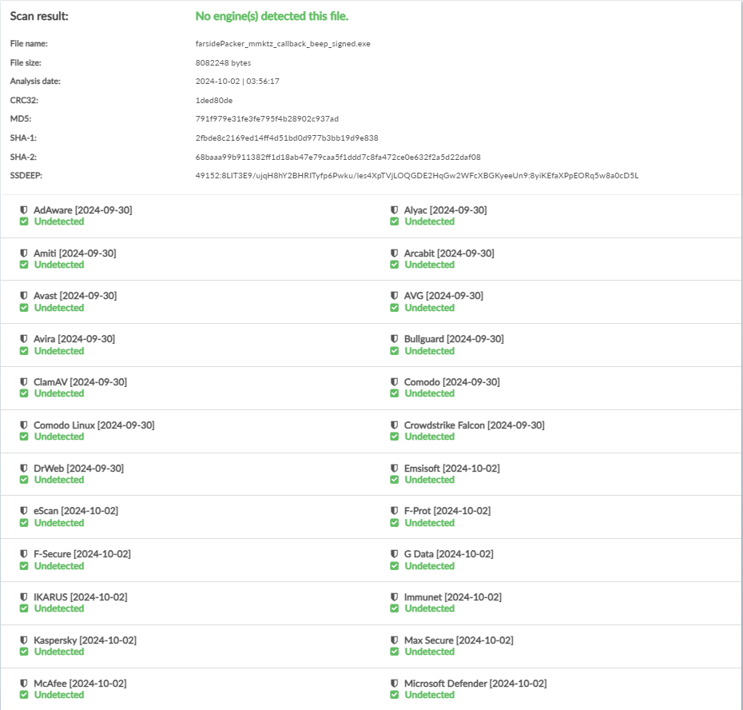
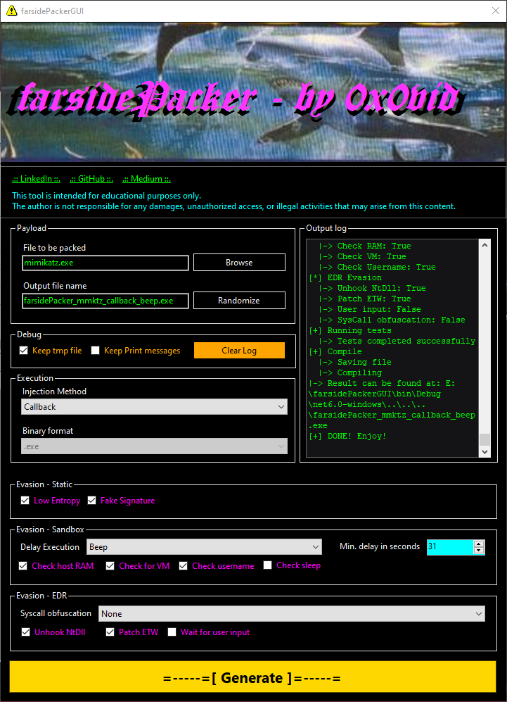
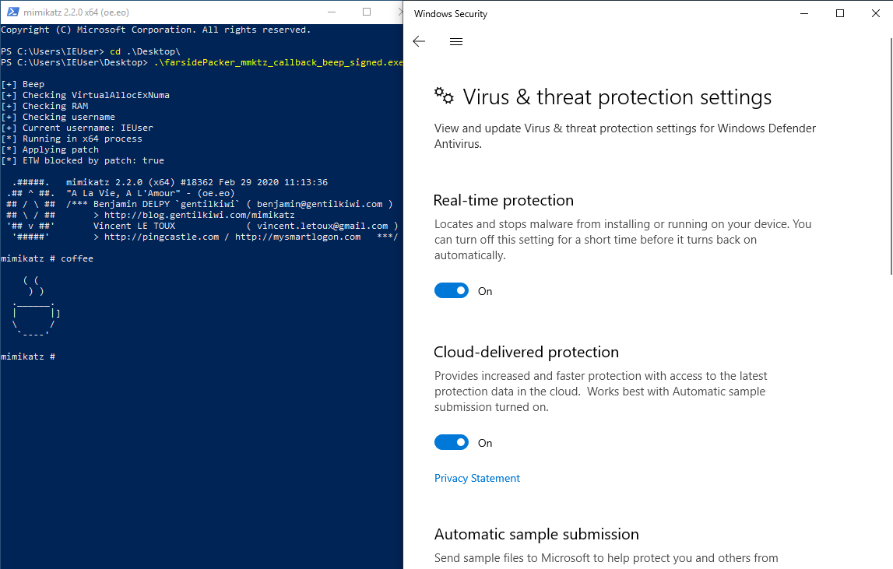

# farsidePacker
[](https://opensource.org/licenses/MIT) 
 
[](#)
[](#) 
[](#)
[](#)

This is a tool i have made for my BSides København talk (2024) - "DIY Trojan horse or: how to get your malware past EDR". The tool demonstrates various methods of bypassing EDR and AV solutions. The tool takes the target binary AES encrypts it and adds the encrypted blob to a stub. The stub is used to unpack the binary in memory, resolve unputs and relocations, and then can use a verity of methods to transfer execution to the injed file.


# Install
For this project to work as intended you will need the following configured:
- A windows machine to run the project from. As of writing the project only supports Windows
- Nim and Python installed and configured in the machines Path. If you can run them both from the commandline as "nim.exe" and "python.exe" you should be good to go
- .NET installed
If that is configured you should be able to simpley do a "git clone" on this repo and move on to getting the nimble packages downliaded and installed.

Installing nim: https://nim-lang.org/install_windows.html/<br>
Installing Python: https://www.python.org/downloads/windows/<br>
Visual Studio: https://visualstudio.microsoft.com/<br>

## Nim dependencies
This project makes use of several nim packages. Therefore these needs to be installed before the project can work as intended. Below is a list of dependencies, these can be installed with nimble.

```
nimble install nimcrypto, winim, ptr_math -y
```

# Usage
To use this for packing your .exe. Either open the solution file (sln) with some version of Visual Studio and complie the project. Else go in the bin folder and use the pre compiled binary in there!
When the GUI is loaded simply select the file you want packet. Add of remove the various options. And finally click the big yellow button and generate the fully packed executable!

## Demo
Kleanscan results<br>


Settings<br>


Running mimikatz on Windows10 with defender active<br>

